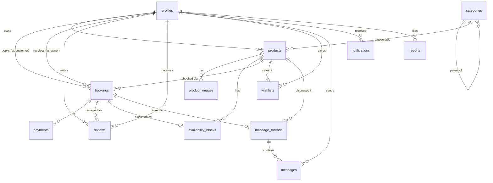

# Nearo — Database Schema

**Status:** Draft v1 — Phase 6 deliverable
**Depends on:** [knowledge/business-rules.md](../knowledge/business-rules.md),
[mvp-scope.md § State Machines](mvp-scope.md#booking-state-machine)
**Implements as:** [supabase/migrations/0001_init.sql](../supabase/migrations/0001_init.sql),
[supabase/migrations/0002_auth_support.sql](../supabase/migrations/0002_auth_support.sql)

## 1. Modeling Assumption Worth Flagging

**Each `products` row represents one physical rentable unit, quantity always 1.** A person
renting out one drone lists one row; they don't manage "stock count." This matches real P2P
physical-goods rental (unlike, say, a tool-rental *business* with 5 identical drills). If a
business owner genuinely has multiple identical units, MVP expects them to create multiple
listings. Modeling quantity/inventory-pooling per listing is explicitly deferred — flag it if this
assumption doesn't hold once real owners onboard.

## 2. Entity Relationship Diagram

## 3. Enums

| Enum | Values |
|---|---|
| `user_role` | `user`, `admin` |
| `product_condition` | `new`, `like_new`, `good`, `fair` |
| `product_status` | `draft`, `available`, `booking_requested`, `booked`, `rented`, `returned`, `hidden`, `maintenance` |
| `booking_status` | `requested`, `accepted`, `rejected`, `cancelled`, `active`, `returned`, `disputed`, `completed` |
| `cancelled_by_party` | `customer`, `owner`, `admin` |
| `payment_type` | `rental_charge`, `deposit_hold`, `deposit_release`, `refund`, `payout` |
| `payment_status` | `pending`, `succeeded`, `failed`, `refunded` |
| `payment_provider` | `mock`, `razorpay` |
| `availability_reason` | `booking`, `owner_block` |
| `report_target_type` | `user`, `product` |
| `report_status` | `open`, `reviewing`, `resolved`, `dismissed` |

## 4. Tables

### `profiles`
One row per `auth.users` row (1:1, id shared). Public-readable subset + private fields.

| Column | Type | Notes |
|---|---|---|
| `id` | uuid, PK, FK → `auth.users.id` | |
| `full_name` | text | |
| `avatar_url` | text, nullable | Supabase Storage path |
| `bio` | text, nullable | |
| `phone` | text, nullable | E.164 format |
| `phone_verified_at` | timestamptz, nullable | Null = unverified |
| `city` | text, nullable | Free-text, launch-city default at signup |
| `role` | `user_role`, default `user` | |
| `rating_avg` | numeric(3,2), default 0 | Denormalized from `reviews`, updated by trigger |
| `rating_count` | int, default 0 | Denormalized |
| `response_rate` | numeric(5,2), nullable | Owner metric; computed periodically, not real-time critical |
| `cancellation_count` | int, default 0 | Owner-side cancellations, stored per [ADR 0004](../decisions/0004-cancellation-deposit-policy.md) |
| `id_verification_status` | text, nullable | Unused in MVP — reserved for [ADR 0003](../decisions/0003-trust-verification-level.md) fast-follow |
| `created_at` / `updated_at` | timestamptz | |

`is_verified` is **not stored** — computed as `phone_verified_at IS NOT NULL AND` the linked
`auth.users.email_confirmed_at IS NOT NULL`, exposed via a Postgres view/function
(`profiles_is_verified(profile_id)`) so it can't drift from the two real signals.

A `profiles` row is created automatically by an `after insert on auth.users` trigger
(`handle_new_user`, in `0002_auth_support.sql`) — this covers email/password signup and Google
OAuth uniformly, so no client code path is responsible for remembering to create it.

### `phone_otps`
Backs the mocked phone-verification flow ([ADR 0006](../decisions/0006-notifications-mocked-multi-channel-adapter.md)).
Real rows, no real SMS sent.

| Column | Type | Notes |
|---|---|---|
| `id` | uuid, PK | |
| `profile_id` | uuid, FK → `profiles.id`, `ON DELETE CASCADE` | |
| `phone` | text | |
| `code` | text | 6-digit code |
| `attempts` | int, default 0 | Incremented on failed verify; locked out after 3 in app logic |
| `expires_at` | timestamptz | |
| `consumed_at` | timestamptz, nullable | Set once successfully verified |
| `created_at` | timestamptz | |

No client RLS policy at all — only Server Actions using the service-role client
([ADR 0007](../decisions/0007-server-actions-vs-route-handlers-vs-direct-queries.md)) touch this
table.

### `categories`
Self-referencing for subcategories (one level deep in MVP — no sub-subcategories).

| Column | Type | Notes |
|---|---|---|
| `id` | uuid, PK | |
| `name` | text | |
| `slug` | text, unique | |
| `icon` | text, nullable | Icon name/key for UI |
| `parent_id` | uuid, nullable, FK → `categories.id` | Null = top-level category |
| `sort_order` | int, default 0 | |
| `is_active` | boolean, default true | Soft-hide without deleting (products still reference it) |
| `created_at` | timestamptz | |

### `products`
| Column | Type | Notes |
|---|---|---|
| `id` | uuid, PK | |
| `owner_id` | uuid, FK → `profiles.id` | |
| `title` | text | |
| `description` | text | |
| `category_id` | uuid, FK → `categories.id` | |
| `subcategory_id` | uuid, nullable, FK → `categories.id` | Must be a child of `category_id` (checked in app layer, not a DB constraint — cross-row check not worth a trigger in MVP) |
| `brand` | text, nullable | |
| `model` | text, nullable | |
| `condition` | `product_condition` | |
| `price_per_day` | numeric(10,2) | INR |
| `security_deposit` | numeric(10,2), default 0 | |
| `min_rental_days` | int, default 1 | |
| `max_rental_days` | int, nullable | Null = no max |
| `pickup_available` | boolean, default true | |
| `delivery_available` | boolean, default false | |
| `delivery_radius_km` | numeric(5,2), nullable | Only meaningful if `delivery_available` |
| `address_text` | text | |
| `city` | text | |
| `lat` / `lng` | double precision | For radius search |
| `visibility_radius_km` | numeric(5,2), default 5 | How far this listing surfaces in nearby search — distinct from a searcher's own radius filter |
| `status` | `product_status`, default `draft` | |
| `slug` | text, nullable, unique | Reserved for fast-follow SEO slugs, unused (null) in MVP |
| `cover_image_url` | text, nullable | Denormalized pointer to the `product_images` row marked `is_cover` |
| `view_count` | int, default 0 | |
| `published_at` | timestamptz, nullable | Set when status first becomes `available` |
| `created_at` / `updated_at` | timestamptz | |

Index: GIST or btree on `(lat, lng)` for radius queries (PostGIS `earthdistance`/`cube` extension
or simple bounding-box + haversine in SQL — see migration file for the chosen approach), plus
btree on `(category_id, status)` for filtered browse queries.

### `product_images`
| Column | Type | Notes |
|---|---|---|
| `id` | uuid, PK | |
| `product_id` | uuid, FK → `products.id`, `ON DELETE CASCADE` | |
| `url` | text | Supabase Storage public/signed URL |
| `sort_order` | int, default 0 | |
| `is_cover` | boolean, default false | Exactly one `true` per product, enforced in app layer at write time |
| `created_at` | timestamptz | |

Max 10 rows per product enforced in app layer (upload flow), not a DB constraint.

### `availability_blocks`
| Column | Type | Notes |
|---|---|---|
| `id` | uuid, PK | |
| `product_id` | uuid, FK → `products.id`, `ON DELETE CASCADE` | |
| `start_date` / `end_date` | date | Inclusive range |
| `reason` | `availability_reason` | |
| `booking_id` | uuid, nullable, FK → `bookings.id` | Set when `reason = 'booking'` |
| `created_at` | timestamptz | |

Overlap prevention: Postgres `EXCLUDE` constraint using `daterange(start_date, end_date, '[]')`
with the `btree_gist` extension, scoped per `product_id` — this is what makes double-booking
structurally impossible, not just app-logic-checked.

### `bookings`
| Column | Type | Notes |
|---|---|---|
| `id` | uuid, PK | |
| `product_id` | uuid, FK → `products.id` | |
| `customer_id` | uuid, FK → `profiles.id` | |
| `owner_id` | uuid, FK → `profiles.id` | Denormalized from `products.owner_id` at creation — simplifies RLS (see §6) and survives a hypothetical future listing-transfer feature |
| `start_date` / `end_date` | date | |
| `status` | `booking_status`, default `requested` | |
| `subtotal_amount` | numeric(10,2) | `price_per_day × days`, snapshotted at request time |
| `platform_fee_rate` | numeric(5,4) | Snapshotted from platform config at **acceptance** time, per [business-rules.md](../knowledge/business-rules.md#monetization) |
| `platform_fee_amount` | numeric(10,2), nullable | Computed at acceptance, null before |
| `deposit_amount` | numeric(10,2) | Snapshotted from `products.security_deposit` at request time |
| `owner_payout_amount` | numeric(10,2), nullable | `subtotal_amount − platform_fee_amount`, computed at acceptance |
| `cancelled_by` | `cancelled_by_party`, nullable | |
| `cancellation_reason` | text, nullable | |
| `requested_at` | timestamptz | |
| `responded_at` | timestamptz, nullable | |
| `started_at` / `returned_at` | timestamptz, nullable | |
| `created_at` / `updated_at` | timestamptz | |

### `payments`
Mock ledger — see [ADR 0005](../decisions/0005-payments-mocked-with-razorpay-adapter.md). Every
row here is real data even though no money moves.

| Column | Type | Notes |
|---|---|---|
| `id` | uuid, PK | |
| `booking_id` | uuid, FK → `bookings.id` | |
| `type` | `payment_type` | |
| `amount` | numeric(10,2) | |
| `currency` | text, default `INR` | |
| `status` | `payment_status` | |
| `provider` | `payment_provider`, default `mock` | |
| `provider_reference` | text, nullable | Fabricated reference string from `MockPaymentProvider` |
| `created_at` | timestamptz | |

### `reviews`
| Column | Type | Notes |
|---|---|---|
| `id` | uuid, PK | |
| `booking_id` | uuid, FK → `bookings.id` | |
| `reviewer_id` | uuid, FK → `profiles.id` | |
| `reviewee_id` | uuid, FK → `profiles.id` | |
| `rating` | smallint, `CHECK (rating BETWEEN 1 AND 5)` | |
| `comment` | text, nullable | |
| `created_at` | timestamptz | |

Unique constraint: `(booking_id, reviewer_id)` — one review per person per booking. Insert only
allowed (app + RLS) when the linked booking's status is `returned`, `disputed`-resolved, or
`completed`.

### `message_threads`
| Column | Type | Notes |
|---|---|---|
| `id` | uuid, PK | |
| `product_id` | uuid, FK → `products.id` | Context for the conversation |
| `booking_id` | uuid, nullable, FK → `bookings.id` | Backfilled once a booking is created from this thread's context, per [user-flows.md §6](user-flows.md#6-messaging) |
| `customer_id` | uuid, FK → `profiles.id` | |
| `owner_id` | uuid, FK → `profiles.id` | |
| `last_message_at` | timestamptz, nullable | Denormalized for inbox sort |
| `created_at` | timestamptz | |

Unique constraint: `(product_id, customer_id)` — one thread per customer per listing, reused
across inquiry → booking → post-rental.

### `messages`
| Column | Type | Notes |
|---|---|---|
| `id` | uuid, PK | |
| `thread_id` | uuid, FK → `message_threads.id`, `ON DELETE CASCADE` | |
| `sender_id` | uuid, FK → `profiles.id` | |
| `body` | text | |
| `read_at` | timestamptz, nullable | |
| `created_at` | timestamptz | |

### `wishlists`
| Column | Type | Notes |
|---|---|---|
| `id` | uuid, PK | |
| `user_id` | uuid, FK → `profiles.id` | |
| `product_id` | uuid, FK → `products.id` | |
| `created_at` | timestamptz | |

Unique constraint: `(user_id, product_id)`.

### `notifications`
Per [ADR 0006](../decisions/0006-notifications-mocked-multi-channel-adapter.md) — the in-app
channel's storage, and the contract every future channel dispatches alongside.

| Column | Type | Notes |
|---|---|---|
| `id` | uuid, PK | |
| `user_id` | uuid, FK → `profiles.id` | Recipient |
| `template_key` | text | One of the keys in [business-rules.md § Notification Events](../knowledge/business-rules.md#notification-events) |
| `payload` | jsonb | Template variables (booking id, listing title, etc.) |
| `read_at` | timestamptz, nullable | |
| `created_at` | timestamptz | |

### `reports`
| Column | Type | Notes |
|---|---|---|
| `id` | uuid, PK | |
| `reporter_id` | uuid, FK → `profiles.id` | |
| `target_type` | `report_target_type` | |
| `target_id` | uuid | Polymorphic — either a `profiles.id` or `products.id` depending on `target_type` |
| `reason` | text | |
| `description` | text, nullable | |
| `status` | `report_status`, default `open` | |
| `resolved_by` | uuid, nullable, FK → `profiles.id` | Must be an admin |
| `resolved_at` | timestamptz, nullable | |
| `created_at` | timestamptz | |

### `platform_settings`
Singleton config, not a per-row business entity — key/value so the platform fee rate (and any
future global config) is a data change, not a code deploy.

| Column | Type | Notes |
|---|---|---|
| `key` | text, PK | e.g. `platform_fee_rate` |
| `value` | jsonb | e.g. `0.12` |
| `updated_at` | timestamptz | |

## 5. Denormalization Choices (and why)

- `bookings.owner_id` duplicates `products.owner_id` — avoids a join in every RLS policy that
  checks "is this user the owner of this booking's product," which runs on nearly every
  owner-side query.
- `products.cover_image_url` duplicates the cover row in `product_images` — every listing card
  everywhere needs exactly this one URL; joining `product_images` + filtering `is_cover` for
  every card in a 24-card grid is wasteful.
- `profiles.rating_avg`/`rating_count` duplicate an aggregate over `reviews` — read-heavy (every
  card, every profile view) vs. write-light (one insert per completed booking); a trigger
  recomputes on `reviews` insert.
- `message_threads.last_message_at` duplicates the max of its `messages` — inbox sorting needs
  this on every load; recomputing via subquery per thread doesn't scale past a handful of threads.

## 6. Row-Level Security — Summary

Full policy SQL is in the migration file; this is the intent each policy encodes.

| Table | Read | Write |
|---|---|---|
| `profiles` | Public fields readable by anyone; full row by self or admin | Self-update only (except `role`, `rating_*` — admin/trigger only) |
| `products` | `available/booked/rented/returned` readable by anyone; `draft/hidden/maintenance` readable by owner + admin only | Owner (own rows) + admin |
| `product_images`, `availability_blocks` | Follows parent `product` visibility | Owner of parent product + admin |
| `bookings` | Customer, owner (of the product), or admin | Customer can insert (`requested`); owner can update status (`accepted`/`rejected`/further); admin can update any |
| `payments` | Participants of the linked booking + admin | System (server-side service role) only — never client-writable |
| `reviews` | Public read | Insert only by a booking participant, only post-completion, per §4 |
| `message_threads`, `messages` | Participants only | Participants only |
| `wishlists` | Self only | Self only |
| `notifications` | Self only | System (service role) inserts; self can mark `read_at` |
| `reports` | Reporter + admin | Reporter can insert; admin can update |
| `platform_settings` | Public read (fee rate needs to be readable client-side for price previews) | Admin only |

## Open Questions

None blocking API Design — the RLS summary above is what API Design's endpoint list is built
against.
