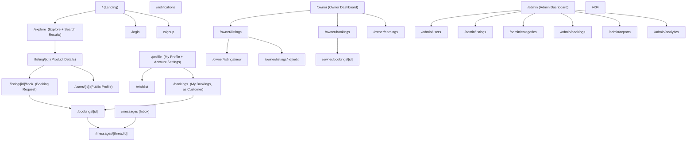

# Nearo — Information Architecture

**Status:** Draft v1 — Phase 2 deliverable
**Depends on:** [prd.md](prd.md), [mvp-scope.md](mvp-scope.md)

## 1. IA Decisions Worth Flagging

Two deliberate simplifications, made now so later phases don't rebuild around a route that
shouldn't exist:

1. **Explore and Search Results are one page, not two.** The brief lists them separately, but
   they're the same UI (grid of listings + filter bar) in two states: no query = browsing/Explore,
   query present = Search Results. One route (`/explore`) driven by query params avoids duplicate
   pages and duplicate filter logic. Category links (`/explore?category=cameras`) and the
   homepage search bar both land here.
2. **Owner mode is a toggle inside one account, not a separate app shell.** Since every user can
   be both Customer and Owner (see [glossary.md](../knowledge/glossary.md)), the header exposes a
   "Switch to hosting" control (Airbnb pattern) that changes the nav's contents in place, rather
   than sending the user to a visually disconnected "seller portal." Admin is the one genuine
   separate shell, because admins are internal team members, not a hat every user wears.

If either of these turns out wrong once wireframes make the flow concrete, raise it before
Wireframes lock it in.

## 2. Sitemap

## 3. Page Inventory

Access levels: **Guest** (anyone) · **Auth** (any logged-in user, either hat) · **Verified**
(logged-in + email/phone verified per [ADR 0003](../decisions/0003-trust-verification-level.md))
· **Admin** (`profiles.role = 'admin'`).

| Route | Page | Access | Purpose |
|---|---|---|---|
| `/` | Landing | Guest | Hero search, trending searches, nearby products, popular categories, how it works, recently listed, testimonials, CTA. |
| `/explore` | Explore / Search Results | Guest | Listing grid + filter bar (keyword, category, distance, price, availability, rating, condition, sort). No query = browse; query params = search results. |
| `/listing/[id]` | Product Details | Guest | Full listing detail: gallery, price, deposit, owner mini-profile + rating, availability calendar, reviews, "Request to Book" CTA. |
| `/listing/[id]/book` | Booking Request | Verified | Pick dates within availability, see price breakdown (subtotal, platform fee note, deposit), submit request. Requires verified email+phone (soft gate — inline prompt to verify if not). |
| `/login` | Login | Guest | Email+password or Google OAuth. |
| `/signup` | Signup | Guest | Email+password or Google OAuth; triggers email verification. |
| `/profile` | My Profile | Auth | Tabs: Public Profile (editable bio/photo/city), Account Settings (email, phone/OTP, password, connected Google account), Verification status. |
| `/users/[id]` | Public Profile | Guest | Read-only: name, photo, verified badge, rating, review count, account age, active listings (if any). |
| `/wishlist` | Wishlist | Auth | Saved listings grid; empty state for new users. |
| `/bookings` | My Bookings | Auth | Customer-side booking history/upcoming, tabbed by status (requested, upcoming, active, past, cancelled). |
| `/bookings/[id]` | Booking Detail | Auth (must be the customer on this booking) | Status, dates, price breakdown, owner contact/chat link, cancel action (if eligible per [business-rules.md](../knowledge/business-rules.md)), review prompt once returned. |
| `/messages` | Inbox | Auth | List of chat threads (one per booking/listing inquiry), unread indicators. |
| `/messages/[threadId]` | Thread | Auth (must be a participant) | 1:1 text messages tied to a booking or listing inquiry. |
| `/notifications` | Notifications | Auth | Full-page view of the same feed as the header bell dropdown — chiefly for mobile. |
| `/owner` | Owner Dashboard | Verified | Snapshot: active listings count, pending requests needing response, upcoming rentals, earnings summary. Entry point after "Switch to hosting." |
| `/owner/listings` | My Listings | Verified | All own listings with status (draft/available/paused/etc.), quick actions (edit, pause, delete). |
| `/owner/listings/new` | Create Listing | Verified | Multi-step form: details → category → pricing/deposit → location/radius → images → availability → review & publish. |
| `/owner/listings/[id]/edit` | Edit Listing | Verified (must own listing) | Same form as Create, pre-filled. |
| `/owner/bookings` | Booking Requests | Verified | Incoming requests to accept/reject; confirmed/active/past bookings across all own listings. |
| `/owner/bookings/[id]` | Owner Booking Detail | Verified (must own listing) | Accept/reject actions, customer mini-profile, chat link, mark-returned action, dispute flag. |
| `/owner/earnings` | Earnings (mock) | Verified | Per-booking gross amount, platform fee deducted, net payout; running total. See [ADR 0001](../decisions/0001-monetization-commission-model.md). |
| `/admin` | Admin Dashboard | Admin | Platform snapshot: new users, new listings, bookings in flight, open reports. |
| `/admin/users` | Users | Admin | Search/list/suspend users. |
| `/admin/listings` | Listings | Admin | Search/list/hide listings; jump to any listing's public page. |
| `/admin/categories` | Categories | Admin | CRUD categories/subcategories (see Database Schema phase for shape). |
| `/admin/bookings` | Bookings | Admin | All bookings across the platform, filterable by status; entry point to resolve `disputed` bookings. |
| `/admin/reports` | Reports | Admin | Flagged listings/users queue, resolution actions. |
| `/admin/analytics` | Analytics | Admin | Basic counts/trends (signups, listings, bookings, completion rate) — see [mvp-scope.md](mvp-scope.md), not a full BI tool in MVP. |
| `/404` | Not Found | Guest | Applies to genuinely missing routes **and** to non-admins hitting any `/admin/*` route (returns 404, not 403 — don't reveal the admin surface exists; see [Security Notes](#5-security--access-notes)). |

## 4. Navigation Model

### Header (desktop), by state

- **Guest:** Logo · Explore link · Search (collapses to icon on non-Explore pages) · "List your
  item" CTA (routes to `/signup` if not logged in, else `/owner/listings/new`) · Login · Signup.
- **Auth, renting mode (default):** Logo · Search · Explore · Wishlist icon · Messages icon
  (unread badge) · Notifications bell (unread badge) · Avatar menu → Profile, My Bookings,
  **Switch to hosting**, Logout.
- **Auth, hosting mode:** Logo · **Switch to renting** · Dashboard · My Listings · Booking
  Requests · Earnings · Messages icon · Notifications bell · Avatar menu → Profile, Logout.
  Hosting mode is a client-side view state on the same account/session, not a different login.
- **Admin:** separate minimal shell — left sidebar (Dashboard, Users, Listings, Categories,
  Bookings, Reports, Analytics), no consumer header/search. An admin account can still visit the
  consumer app normally at `/`; `/admin` is a distinct surface, not a merged nav.

### Mobile (bottom tab bar)

- **Renting mode:** Explore · Wishlist · Bookings · Messages · Profile.
- **Hosting mode:** Dashboard · Listings · Requests · Earnings · Profile.
- Admin has no mobile-optimized nav in MVP (internal tool, desktop-first is acceptable per
  design-language brief).

### Footer (all public pages)

Category shortcuts, How it works, About, Contact/Support, Legal placeholders (Terms/Privacy —
content itself is out of scope for MVP build, but links should exist and not 404 embarrassingly;
route to a simple static page, not a broken link).

## 5. Security & Access Notes

- Unauthenticated user hitting an Auth/Verified route → redirect to `/login?redirect=<path>`,
  return to `<path>` after login.
- Auth-but-unverified user hitting a Verified route's *action* (submit booking request, publish
  listing) → inline verification prompt (send OTP), not a full-page redirect — verification is a
  soft gate meant to be cleared in-flow, per [ADR 0003](../decisions/0003-trust-verification-level.md).
- Non-owner hitting another owner's `/owner/listings/[id]/edit` or `/owner/bookings/[id]` →
  404, not 403 (don't confirm the resource exists to someone who shouldn't see it).
- Non-admin hitting any `/admin/*` route → 404, same reasoning.
- These are enforced server-side (Supabase RLS + route handlers), never client-side-only — full
  detail lands in the API Design and Database Schema phases.

## 6. URL & Slug Conventions

- Listings: `/listing/[id]` using the product's public identifier. Human-readable slugs
  (`/listing/canon-eos-r5-a1b2c3`) are a fast-follow SEO improvement, not MVP-blocking — schema
  should reserve a nullable `slug` column now so it's additive later, not a migration.
- Users: `/users/[id]`.
- Search/filter state lives entirely in query params on `/explore` (`q`, `category`, `minPrice`,
  `maxPrice`, `lat`, `lng`, `radiusKm`, `availableFrom`, `availableTo`, `condition`, `rating`,
  `sort`) so results are shareable/bookmarkable links, not client-only state.
- Category browsing is `/explore?category=<slug>`, not a separate `/category/[slug]` route (see
  §1 decision #1).

## 7. Open Questions

None blocking Phase 3. If Wireframes reveal that merging Explore/Search or the hosting-mode
toggle doesn't hold up in practice, flag it before proceeding rather than quietly reintroducing
separate routes.
