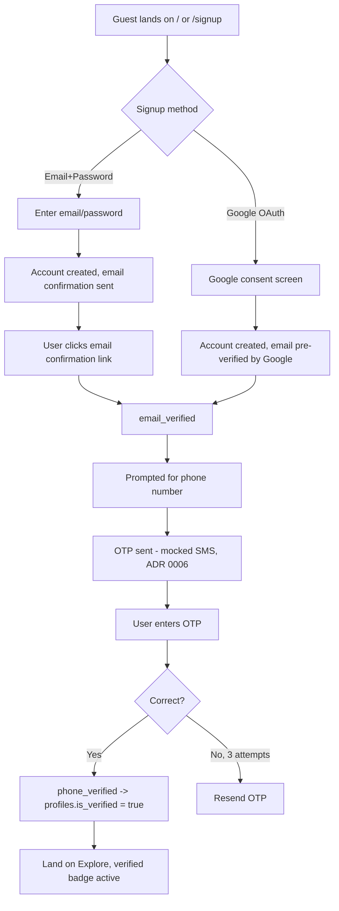
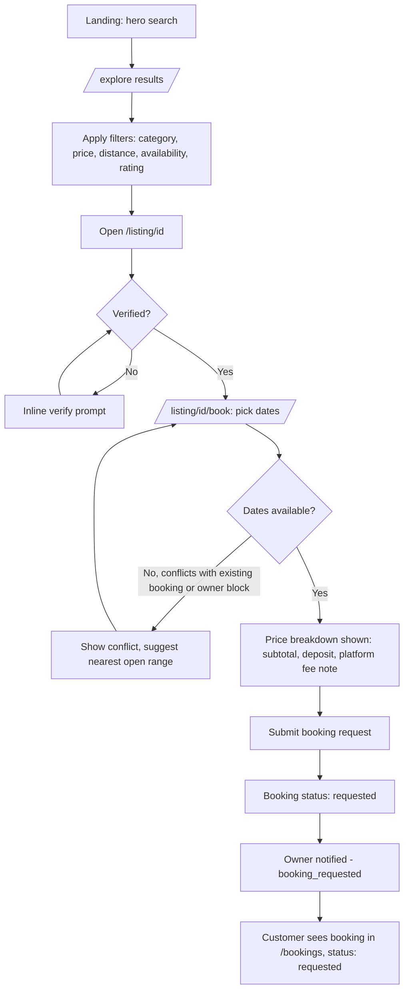
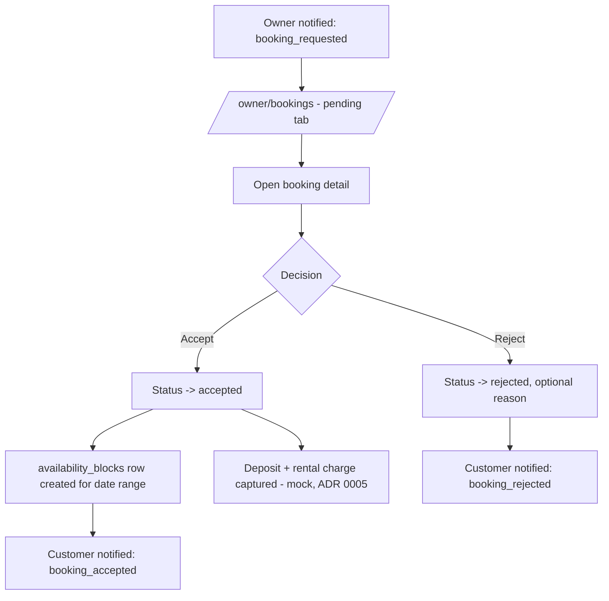
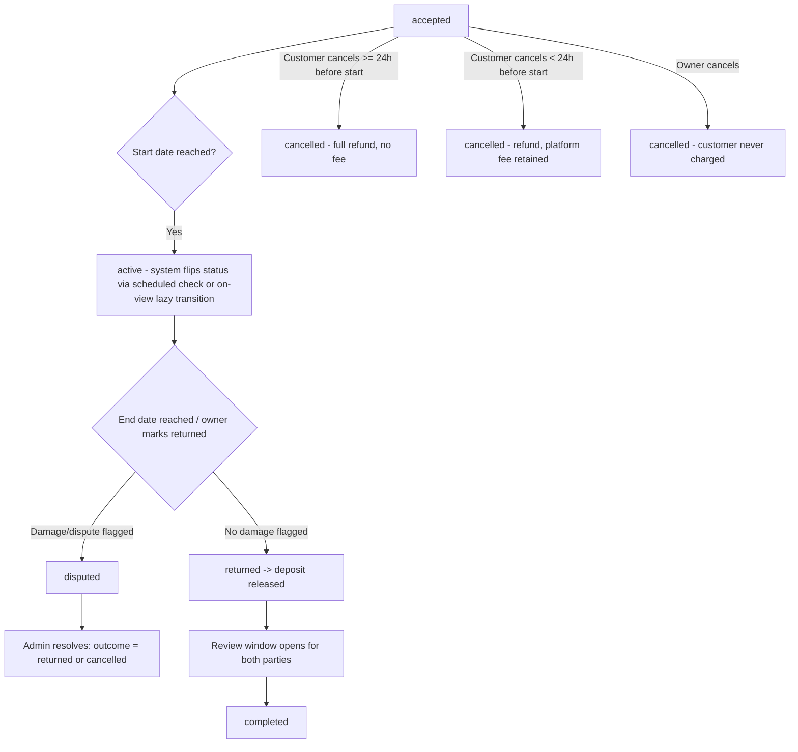
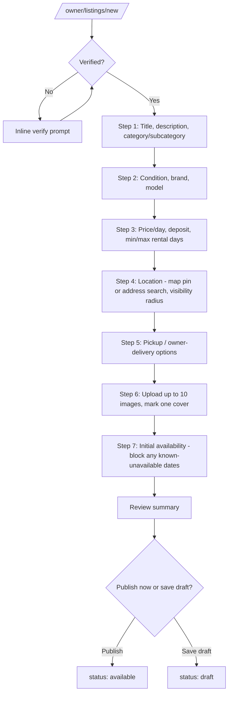
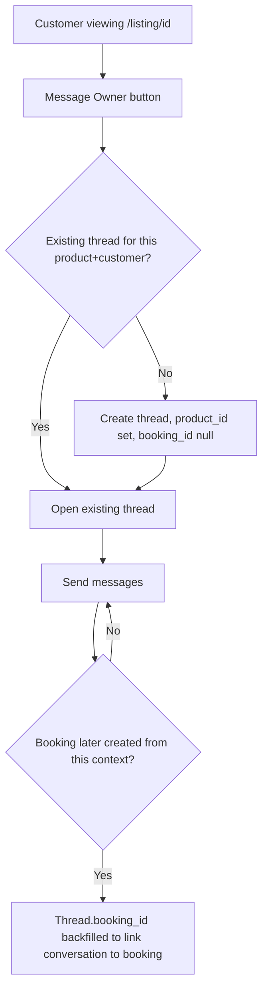
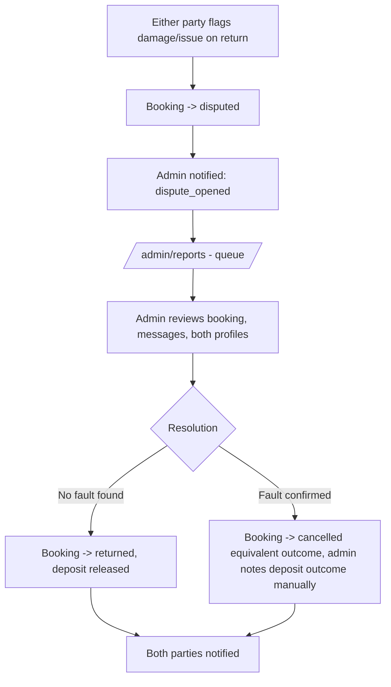

# Nearo — User Flows

**Status:** Draft v1 — Phase 3 deliverable
**Depends on:** [prd.md](prd.md), [information-architecture.md](information-architecture.md),
[knowledge/business-rules.md](../knowledge/business-rules.md)

Status/role names used below match [mvp-scope.md](mvp-scope.md) and
[database-schema.md](database-schema.md) exactly — don't paraphrase them elsewhere.

## 1. Signup & Verification

- Phone verification is **not** forced immediately at signup — a user can browse fully unverified.
  It's only enforced as a soft gate at the two action points that need it: submitting a booking
  request and publishing a listing (see [ADR 0003](../decisions/0003-trust-verification-level.md)).
- If a user reaches the Book or Publish action unverified, the OTP step above is triggered inline
  from wherever they are, then returns them to that action — never a full-page redirect.

## 2. Discover → Book (core journey)

- Availability conflict check happens both client-side (calendar greys out blocked dates from
  `availability_blocks`) and server-side at submission (race condition: two customers requesting
  overlapping dates simultaneously) — server is authoritative, per
  [api-design.md](api-design.md).
- Platform fee is **shown as a note, not itemized as a separate line the customer pays** — the fee
  is deducted from the owner's payout, not added on top of the customer's price, per
  [ADR 0001](../decisions/0001-monetization-commission-model.md). The price breakdown customer
  sees is: rental subtotal + security deposit = total to pay (mock).

## 3. Owner Responds to a Booking Request

- No response within 24h is tracked against the owner's `response_rate` (see
  [prd.md § Risks](prd.md#11-risks)) but does **not** auto-expire the request in MVP — auto-expiry
  is a named fast-follow, not silently built now.

## 4. Rental Lifecycle & Cancellation

- Exact conditions for each transition are the single-source rules in
  [business-rules.md § Cancellation & Deposit](../knowledge/business-rules.md#cancellation--deposit) —
  this diagram is shape only.
- "System flips status" for `accepted → active` and `active → returned` (time-based) is a lazy
  transition computed on read in MVP (no cron job) — see
  [api-design.md](api-design.md) for where that check lives.

## 5. Owner Creates a Listing

- Every step is saved incrementally (draft row created on Step 1 submit) so a user who abandons
  partway can resume — no client-only wizard state that vanishes on refresh.
- Edit Listing reuses this exact same step form pre-filled, not a separate simplified form.

## 6. Messaging

- One thread per (customer, product) pair covers both the pre-booking inquiry and the
  post-acceptance conversation — no second thread spawned when a booking is created, so context
  isn't lost. See `message_threads` unique constraint in
  [database-schema.md](database-schema.md).

## 7. Dispute Resolution (Admin)

- MVP has **no automated partial-deposit-forfeiture math** — admin resolution is a manual
  judgment call recorded as notes, per [ADR 0004](../decisions/0004-cancellation-deposit-policy.md).
  Building an automated adjudication engine is explicitly out of scope.

## Open Questions

None blocking Wireframes. The lazy status-transition mechanism (§4, §3) needs a concrete
implementation decision in API Design — flagged there, not decided here.
